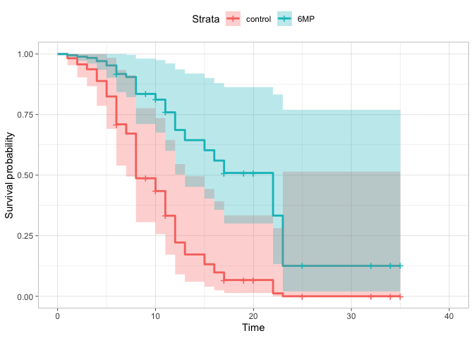

Survival analysis
================
Tomoya Ozawa
2023-07-07

# Non parametric model

- we do not assume any distribution assumption and do not use
  covariates.

## Set up

[Reference](https://note.com/maxwell/n/nc78c55afe944?magazine_key=mc84c90fb0e35)

``` r
library(tidyverse)
library(MASS)
library(survival)
library(survminer)
```

``` r
data(gehan)
gehan
```

    ##    pair time cens   treat
    ## 1     1    1    1 control
    ## 2     1   10    1    6-MP
    ## 3     2   22    1 control
    ## 4     2    7    1    6-MP
    ## 5     3    3    1 control
    ## 6     3   32    0    6-MP
    ## 7     4   12    1 control
    ## 8     4   23    1    6-MP
    ## 9     5    8    1 control
    ## 10    5   22    1    6-MP
    ## 11    6   17    1 control
    ## 12    6    6    1    6-MP
    ## 13    7    2    1 control
    ## 14    7   16    1    6-MP
    ## 15    8   11    1 control
    ## 16    8   34    0    6-MP
    ## 17    9    8    1 control
    ## 18    9   32    0    6-MP
    ## 19   10   12    1 control
    ## 20   10   25    0    6-MP
    ## 21   11    2    1 control
    ## 22   11   11    0    6-MP
    ## 23   12    5    1 control
    ## 24   12   20    0    6-MP
    ## 25   13    4    1 control
    ## 26   13   19    0    6-MP
    ## 27   14   15    1 control
    ## 28   14    6    1    6-MP
    ## 29   15    8    1 control
    ## 30   15   17    0    6-MP
    ## 31   16   23    1 control
    ## 32   16   35    0    6-MP
    ## 33   17    5    1 control
    ## 34   17    6    1    6-MP
    ## 35   18   11    1 control
    ## 36   18   13    1    6-MP
    ## 37   19    4    1 control
    ## 38   19    9    0    6-MP
    ## 39   20    1    1 control
    ## 40   20    6    0    6-MP
    ## 41   21    8    1 control
    ## 42   21   10    0    6-MP

- this data set is identified with pair and treat
- columns:
  - `time`: duration individual exists
  - `cens`: takes 1 if the observation is censored

``` r
cut.points <- gehan %>% 
  filter(cens == 1) %>% 
  arrange(time) %>% 
  pull(time) %>% 
  unique()

cut.points
```

    ##  [1]  1  2  3  4  5  6  7  8 10 11 12 13 15 16 17 22 23

``` r
gehan2 <- survival::survSplit(data = gehan, 
                              cut = cut.points,
                              start = "start",
                              end = "time",
                              event = "cens")
colnames(gehan2)[4] <- "stop"
gehan2
```

    ##     pair   treat start stop cens
    ## 1      1 control     0    1    1
    ## 2      1    6-MP     0    1    0
    ## 3      1    6-MP     1    2    0
    ## 4      1    6-MP     2    3    0
    ## 5      1    6-MP     3    4    0
    ## 6      1    6-MP     4    5    0
    ## 7      1    6-MP     5    6    0
    ## 8      1    6-MP     6    7    0
    ## 9      1    6-MP     7    8    0
    ## 10     1    6-MP     8   10    1
    ## 11     2 control     0    1    0
    ## 12     2 control     1    2    0
    ## 13     2 control     2    3    0
    ## 14     2 control     3    4    0
    ## 15     2 control     4    5    0
    ## 16     2 control     5    6    0
    ## 17     2 control     6    7    0
    ## 18     2 control     7    8    0
    ## 19     2 control     8   10    0
    ## 20     2 control    10   11    0
    ## 21     2 control    11   12    0
    ## 22     2 control    12   13    0
    ## 23     2 control    13   15    0
    ## 24     2 control    15   16    0
    ## 25     2 control    16   17    0
    ## 26     2 control    17   22    1
    ## 27     2    6-MP     0    1    0
    ## 28     2    6-MP     1    2    0
    ## 29     2    6-MP     2    3    0
    ## 30     2    6-MP     3    4    0
    ## 31     2    6-MP     4    5    0
    ## 32     2    6-MP     5    6    0
    ## 33     2    6-MP     6    7    1
    ## 34     3 control     0    1    0
    ## 35     3 control     1    2    0
    ## 36     3 control     2    3    1
    ## 37     3    6-MP     0    1    0
    ## 38     3    6-MP     1    2    0
    ## 39     3    6-MP     2    3    0
    ## 40     3    6-MP     3    4    0
    ## 41     3    6-MP     4    5    0
    ## 42     3    6-MP     5    6    0
    ## 43     3    6-MP     6    7    0
    ## 44     3    6-MP     7    8    0
    ## 45     3    6-MP     8   10    0
    ## 46     3    6-MP    10   11    0
    ## 47     3    6-MP    11   12    0
    ## 48     3    6-MP    12   13    0
    ## 49     3    6-MP    13   15    0
    ## 50     3    6-MP    15   16    0
    ## 51     3    6-MP    16   17    0
    ## 52     3    6-MP    17   22    0
    ## 53     3    6-MP    22   23    0
    ## 54     3    6-MP    23   32    0
    ## 55     4 control     0    1    0
    ## 56     4 control     1    2    0
    ## 57     4 control     2    3    0
    ## 58     4 control     3    4    0
    ## 59     4 control     4    5    0
    ## 60     4 control     5    6    0
    ## 61     4 control     6    7    0
    ## 62     4 control     7    8    0
    ## 63     4 control     8   10    0
    ## 64     4 control    10   11    0
    ## 65     4 control    11   12    1
    ## 66     4    6-MP     0    1    0
    ## 67     4    6-MP     1    2    0
    ## 68     4    6-MP     2    3    0
    ## 69     4    6-MP     3    4    0
    ## 70     4    6-MP     4    5    0
    ## 71     4    6-MP     5    6    0
    ## 72     4    6-MP     6    7    0
    ## 73     4    6-MP     7    8    0
    ## 74     4    6-MP     8   10    0
    ## 75     4    6-MP    10   11    0
    ## 76     4    6-MP    11   12    0
    ## 77     4    6-MP    12   13    0
    ## 78     4    6-MP    13   15    0
    ## 79     4    6-MP    15   16    0
    ## 80     4    6-MP    16   17    0
    ## 81     4    6-MP    17   22    0
    ## 82     4    6-MP    22   23    1
    ## 83     5 control     0    1    0
    ## 84     5 control     1    2    0
    ## 85     5 control     2    3    0
    ## 86     5 control     3    4    0
    ## 87     5 control     4    5    0
    ## 88     5 control     5    6    0
    ## 89     5 control     6    7    0
    ## 90     5 control     7    8    1
    ## 91     5    6-MP     0    1    0
    ## 92     5    6-MP     1    2    0
    ## 93     5    6-MP     2    3    0
    ## 94     5    6-MP     3    4    0
    ## 95     5    6-MP     4    5    0
    ## 96     5    6-MP     5    6    0
    ## 97     5    6-MP     6    7    0
    ## 98     5    6-MP     7    8    0
    ## 99     5    6-MP     8   10    0
    ## 100    5    6-MP    10   11    0
    ## 101    5    6-MP    11   12    0
    ## 102    5    6-MP    12   13    0
    ## 103    5    6-MP    13   15    0
    ## 104    5    6-MP    15   16    0
    ## 105    5    6-MP    16   17    0
    ## 106    5    6-MP    17   22    1
    ## 107    6 control     0    1    0
    ## 108    6 control     1    2    0
    ## 109    6 control     2    3    0
    ## 110    6 control     3    4    0
    ## 111    6 control     4    5    0
    ## 112    6 control     5    6    0
    ## 113    6 control     6    7    0
    ## 114    6 control     7    8    0
    ## 115    6 control     8   10    0
    ## 116    6 control    10   11    0
    ## 117    6 control    11   12    0
    ## 118    6 control    12   13    0
    ## 119    6 control    13   15    0
    ## 120    6 control    15   16    0
    ## 121    6 control    16   17    1
    ## 122    6    6-MP     0    1    0
    ## 123    6    6-MP     1    2    0
    ## 124    6    6-MP     2    3    0
    ## 125    6    6-MP     3    4    0
    ## 126    6    6-MP     4    5    0
    ## 127    6    6-MP     5    6    1
    ## 128    7 control     0    1    0
    ## 129    7 control     1    2    1
    ## 130    7    6-MP     0    1    0
    ## 131    7    6-MP     1    2    0
    ## 132    7    6-MP     2    3    0
    ## 133    7    6-MP     3    4    0
    ## 134    7    6-MP     4    5    0
    ## 135    7    6-MP     5    6    0
    ## 136    7    6-MP     6    7    0
    ## 137    7    6-MP     7    8    0
    ## 138    7    6-MP     8   10    0
    ## 139    7    6-MP    10   11    0
    ## 140    7    6-MP    11   12    0
    ## 141    7    6-MP    12   13    0
    ## 142    7    6-MP    13   15    0
    ## 143    7    6-MP    15   16    1
    ## 144    8 control     0    1    0
    ## 145    8 control     1    2    0
    ## 146    8 control     2    3    0
    ## 147    8 control     3    4    0
    ## 148    8 control     4    5    0
    ## 149    8 control     5    6    0
    ## 150    8 control     6    7    0
    ## 151    8 control     7    8    0
    ## 152    8 control     8   10    0
    ## 153    8 control    10   11    1
    ## 154    8    6-MP     0    1    0
    ## 155    8    6-MP     1    2    0
    ## 156    8    6-MP     2    3    0
    ## 157    8    6-MP     3    4    0
    ## 158    8    6-MP     4    5    0
    ## 159    8    6-MP     5    6    0
    ## 160    8    6-MP     6    7    0
    ## 161    8    6-MP     7    8    0
    ## 162    8    6-MP     8   10    0
    ## 163    8    6-MP    10   11    0
    ## 164    8    6-MP    11   12    0
    ## 165    8    6-MP    12   13    0
    ## 166    8    6-MP    13   15    0
    ## 167    8    6-MP    15   16    0
    ## 168    8    6-MP    16   17    0
    ## 169    8    6-MP    17   22    0
    ## 170    8    6-MP    22   23    0
    ## 171    8    6-MP    23   34    0
    ## 172    9 control     0    1    0
    ## 173    9 control     1    2    0
    ## 174    9 control     2    3    0
    ## 175    9 control     3    4    0
    ## 176    9 control     4    5    0
    ## 177    9 control     5    6    0
    ## 178    9 control     6    7    0
    ## 179    9 control     7    8    1
    ## 180    9    6-MP     0    1    0
    ## 181    9    6-MP     1    2    0
    ## 182    9    6-MP     2    3    0
    ## 183    9    6-MP     3    4    0
    ## 184    9    6-MP     4    5    0
    ## 185    9    6-MP     5    6    0
    ## 186    9    6-MP     6    7    0
    ## 187    9    6-MP     7    8    0
    ## 188    9    6-MP     8   10    0
    ## 189    9    6-MP    10   11    0
    ## 190    9    6-MP    11   12    0
    ## 191    9    6-MP    12   13    0
    ## 192    9    6-MP    13   15    0
    ## 193    9    6-MP    15   16    0
    ## 194    9    6-MP    16   17    0
    ## 195    9    6-MP    17   22    0
    ## 196    9    6-MP    22   23    0
    ## 197    9    6-MP    23   32    0
    ## 198   10 control     0    1    0
    ## 199   10 control     1    2    0
    ## 200   10 control     2    3    0
    ## 201   10 control     3    4    0
    ## 202   10 control     4    5    0
    ## 203   10 control     5    6    0
    ## 204   10 control     6    7    0
    ## 205   10 control     7    8    0
    ## 206   10 control     8   10    0
    ## 207   10 control    10   11    0
    ## 208   10 control    11   12    1
    ## 209   10    6-MP     0    1    0
    ## 210   10    6-MP     1    2    0
    ## 211   10    6-MP     2    3    0
    ## 212   10    6-MP     3    4    0
    ## 213   10    6-MP     4    5    0
    ## 214   10    6-MP     5    6    0
    ## 215   10    6-MP     6    7    0
    ## 216   10    6-MP     7    8    0
    ## 217   10    6-MP     8   10    0
    ## 218   10    6-MP    10   11    0
    ## 219   10    6-MP    11   12    0
    ## 220   10    6-MP    12   13    0
    ## 221   10    6-MP    13   15    0
    ## 222   10    6-MP    15   16    0
    ## 223   10    6-MP    16   17    0
    ## 224   10    6-MP    17   22    0
    ## 225   10    6-MP    22   23    0
    ## 226   10    6-MP    23   25    0
    ## 227   11 control     0    1    0
    ## 228   11 control     1    2    1
    ## 229   11    6-MP     0    1    0
    ## 230   11    6-MP     1    2    0
    ## 231   11    6-MP     2    3    0
    ## 232   11    6-MP     3    4    0
    ## 233   11    6-MP     4    5    0
    ## 234   11    6-MP     5    6    0
    ## 235   11    6-MP     6    7    0
    ## 236   11    6-MP     7    8    0
    ## 237   11    6-MP     8   10    0
    ## 238   11    6-MP    10   11    0
    ## 239   12 control     0    1    0
    ## 240   12 control     1    2    0
    ## 241   12 control     2    3    0
    ## 242   12 control     3    4    0
    ## 243   12 control     4    5    1
    ## 244   12    6-MP     0    1    0
    ## 245   12    6-MP     1    2    0
    ## 246   12    6-MP     2    3    0
    ## 247   12    6-MP     3    4    0
    ## 248   12    6-MP     4    5    0
    ## 249   12    6-MP     5    6    0
    ## 250   12    6-MP     6    7    0
    ## 251   12    6-MP     7    8    0
    ## 252   12    6-MP     8   10    0
    ## 253   12    6-MP    10   11    0
    ## 254   12    6-MP    11   12    0
    ## 255   12    6-MP    12   13    0
    ## 256   12    6-MP    13   15    0
    ## 257   12    6-MP    15   16    0
    ## 258   12    6-MP    16   17    0
    ## 259   12    6-MP    17   20    0
    ## 260   13 control     0    1    0
    ## 261   13 control     1    2    0
    ## 262   13 control     2    3    0
    ## 263   13 control     3    4    1
    ## 264   13    6-MP     0    1    0
    ## 265   13    6-MP     1    2    0
    ## 266   13    6-MP     2    3    0
    ## 267   13    6-MP     3    4    0
    ## 268   13    6-MP     4    5    0
    ## 269   13    6-MP     5    6    0
    ## 270   13    6-MP     6    7    0
    ## 271   13    6-MP     7    8    0
    ## 272   13    6-MP     8   10    0
    ## 273   13    6-MP    10   11    0
    ## 274   13    6-MP    11   12    0
    ## 275   13    6-MP    12   13    0
    ## 276   13    6-MP    13   15    0
    ## 277   13    6-MP    15   16    0
    ## 278   13    6-MP    16   17    0
    ## 279   13    6-MP    17   19    0
    ## 280   14 control     0    1    0
    ## 281   14 control     1    2    0
    ## 282   14 control     2    3    0
    ## 283   14 control     3    4    0
    ## 284   14 control     4    5    0
    ## 285   14 control     5    6    0
    ## 286   14 control     6    7    0
    ## 287   14 control     7    8    0
    ## 288   14 control     8   10    0
    ## 289   14 control    10   11    0
    ## 290   14 control    11   12    0
    ## 291   14 control    12   13    0
    ## 292   14 control    13   15    1
    ## 293   14    6-MP     0    1    0
    ## 294   14    6-MP     1    2    0
    ## 295   14    6-MP     2    3    0
    ## 296   14    6-MP     3    4    0
    ## 297   14    6-MP     4    5    0
    ## 298   14    6-MP     5    6    1
    ## 299   15 control     0    1    0
    ## 300   15 control     1    2    0
    ## 301   15 control     2    3    0
    ## 302   15 control     3    4    0
    ## 303   15 control     4    5    0
    ## 304   15 control     5    6    0
    ## 305   15 control     6    7    0
    ## 306   15 control     7    8    1
    ## 307   15    6-MP     0    1    0
    ## 308   15    6-MP     1    2    0
    ## 309   15    6-MP     2    3    0
    ## 310   15    6-MP     3    4    0
    ## 311   15    6-MP     4    5    0
    ## 312   15    6-MP     5    6    0
    ## 313   15    6-MP     6    7    0
    ## 314   15    6-MP     7    8    0
    ## 315   15    6-MP     8   10    0
    ## 316   15    6-MP    10   11    0
    ## 317   15    6-MP    11   12    0
    ## 318   15    6-MP    12   13    0
    ## 319   15    6-MP    13   15    0
    ## 320   15    6-MP    15   16    0
    ## 321   15    6-MP    16   17    0
    ## 322   16 control     0    1    0
    ## 323   16 control     1    2    0
    ## 324   16 control     2    3    0
    ## 325   16 control     3    4    0
    ## 326   16 control     4    5    0
    ## 327   16 control     5    6    0
    ## 328   16 control     6    7    0
    ## 329   16 control     7    8    0
    ## 330   16 control     8   10    0
    ## 331   16 control    10   11    0
    ## 332   16 control    11   12    0
    ## 333   16 control    12   13    0
    ## 334   16 control    13   15    0
    ## 335   16 control    15   16    0
    ## 336   16 control    16   17    0
    ## 337   16 control    17   22    0
    ## 338   16 control    22   23    1
    ## 339   16    6-MP     0    1    0
    ## 340   16    6-MP     1    2    0
    ## 341   16    6-MP     2    3    0
    ## 342   16    6-MP     3    4    0
    ## 343   16    6-MP     4    5    0
    ## 344   16    6-MP     5    6    0
    ## 345   16    6-MP     6    7    0
    ## 346   16    6-MP     7    8    0
    ## 347   16    6-MP     8   10    0
    ## 348   16    6-MP    10   11    0
    ## 349   16    6-MP    11   12    0
    ## 350   16    6-MP    12   13    0
    ## 351   16    6-MP    13   15    0
    ## 352   16    6-MP    15   16    0
    ## 353   16    6-MP    16   17    0
    ## 354   16    6-MP    17   22    0
    ## 355   16    6-MP    22   23    0
    ## 356   16    6-MP    23   35    0
    ## 357   17 control     0    1    0
    ## 358   17 control     1    2    0
    ## 359   17 control     2    3    0
    ## 360   17 control     3    4    0
    ## 361   17 control     4    5    1
    ## 362   17    6-MP     0    1    0
    ## 363   17    6-MP     1    2    0
    ## 364   17    6-MP     2    3    0
    ## 365   17    6-MP     3    4    0
    ## 366   17    6-MP     4    5    0
    ## 367   17    6-MP     5    6    1
    ## 368   18 control     0    1    0
    ## 369   18 control     1    2    0
    ## 370   18 control     2    3    0
    ## 371   18 control     3    4    0
    ## 372   18 control     4    5    0
    ## 373   18 control     5    6    0
    ## 374   18 control     6    7    0
    ## 375   18 control     7    8    0
    ## 376   18 control     8   10    0
    ## 377   18 control    10   11    1
    ## 378   18    6-MP     0    1    0
    ## 379   18    6-MP     1    2    0
    ## 380   18    6-MP     2    3    0
    ## 381   18    6-MP     3    4    0
    ## 382   18    6-MP     4    5    0
    ## 383   18    6-MP     5    6    0
    ## 384   18    6-MP     6    7    0
    ## 385   18    6-MP     7    8    0
    ## 386   18    6-MP     8   10    0
    ## 387   18    6-MP    10   11    0
    ## 388   18    6-MP    11   12    0
    ## 389   18    6-MP    12   13    1
    ## 390   19 control     0    1    0
    ## 391   19 control     1    2    0
    ## 392   19 control     2    3    0
    ## 393   19 control     3    4    1
    ## 394   19    6-MP     0    1    0
    ## 395   19    6-MP     1    2    0
    ## 396   19    6-MP     2    3    0
    ## 397   19    6-MP     3    4    0
    ## 398   19    6-MP     4    5    0
    ## 399   19    6-MP     5    6    0
    ## 400   19    6-MP     6    7    0
    ## 401   19    6-MP     7    8    0
    ## 402   19    6-MP     8    9    0
    ## 403   20 control     0    1    1
    ## 404   20    6-MP     0    1    0
    ## 405   20    6-MP     1    2    0
    ## 406   20    6-MP     2    3    0
    ## 407   20    6-MP     3    4    0
    ## 408   20    6-MP     4    5    0
    ## 409   20    6-MP     5    6    0
    ## 410   21 control     0    1    0
    ## 411   21 control     1    2    0
    ## 412   21 control     2    3    0
    ## 413   21 control     3    4    0
    ## 414   21 control     4    5    0
    ## 415   21 control     5    6    0
    ## 416   21 control     6    7    0
    ## 417   21 control     7    8    1
    ## 418   21    6-MP     0    1    0
    ## 419   21    6-MP     1    2    0
    ## 420   21    6-MP     2    3    0
    ## 421   21    6-MP     3    4    0
    ## 422   21    6-MP     4    5    0
    ## 423   21    6-MP     5    6    0
    ## 424   21    6-MP     6    7    0
    ## 425   21    6-MP     7    8    0
    ## 426   21    6-MP     8   10    0

## Kaplan-Meier Curve

- compute the survival function,
   = 1-F(t)")

``` r
# create object for survival analysis
surv.obj <- Surv(time = gehan$time, event = gehan$cens)

# estimate Kaplan-Meier curve for each value in specified variable
# in this case, plot the curve for treat or not
ge.sf <- survfit(surv.obj ~ treat, data = gehan)

# dataframe showing the estimation result
ge.sf.df <- survminer::surv_summary(ge.sf, data = gehan)
ge.sf.df
```

    ##    time n.risk n.event n.censor       surv    std.err     upper      lower
    ## 1     6     21       3        1 0.85714286 0.08908708 1.0000000 0.71981708
    ## 2     7     17       1        0 0.80672269 0.10776353 0.9964437 0.65312422
    ## 3     9     16       0        1 0.80672269 0.10776353 0.9964437 0.65312422
    ## 4    10     15       1        1 0.75294118 0.12796438 0.9675748 0.58591898
    ## 5    11     13       0        1 0.75294118 0.12796438 0.9675748 0.58591898
    ## 6    13     12       1        0 0.69019608 0.15475995 0.9347692 0.50961310
    ## 7    16     11       1        0 0.62745098 0.18177335 0.8959949 0.43939392
    ## 8    17     10       0        1 0.62745098 0.18177335 0.8959949 0.43939392
    ## 9    19      9       0        1 0.62745098 0.18177335 0.8959949 0.43939392
    ## 10   20      8       0        1 0.62745098 0.18177335 0.8959949 0.43939392
    ## 11   22      7       1        0 0.53781513 0.23843463 0.8582008 0.33703662
    ## 12   23      6       1        0 0.44817927 0.30030719 0.8073720 0.24878823
    ## 13   25      5       0        1 0.44817927 0.30030719 0.8073720 0.24878823
    ## 14   32      4       0        2 0.44817927 0.30030719 0.8073720 0.24878823
    ## 15   34      2       0        1 0.44817927 0.30030719 0.8073720 0.24878823
    ## 16   35      1       0        1 0.44817927 0.30030719 0.8073720 0.24878823
    ## 17    1     21       2        0 0.90476190 0.07079923 1.0000000 0.78753505
    ## 18    2     19       2        0 0.80952381 0.10585122 0.9961629 0.65785306
    ## 19    3     17       1        0 0.76190476 0.12198751 0.9676909 0.59988048
    ## 20    4     16       2        0 0.66666667 0.15430335 0.9020944 0.49268063
    ## 21    5     14       2        0 0.57142857 0.18898224 0.8276066 0.39454812
    ## 22    8     12       4        0 0.38095238 0.27817432 0.6571327 0.22084536
    ## 23   11      8       2        0 0.28571429 0.34503278 0.5618552 0.14529127
    ## 24   12      6       2        0 0.19047619 0.44986771 0.4600116 0.07887014
    ## 25   15      4       1        0 0.14285714 0.53452248 0.4072755 0.05010898
    ## 26   17      3       1        0 0.09523810 0.67259271 0.3558956 0.02548583
    ## 27   22      2       1        0 0.04761905 0.97590007 0.3224544 0.00703223
    ## 28   23      1       1        0 0.00000000        Inf        NA         NA
    ##           strata   treat
    ## 1     treat=6-MP    6-MP
    ## 2     treat=6-MP    6-MP
    ## 3     treat=6-MP    6-MP
    ## 4     treat=6-MP    6-MP
    ## 5     treat=6-MP    6-MP
    ## 6     treat=6-MP    6-MP
    ## 7     treat=6-MP    6-MP
    ## 8     treat=6-MP    6-MP
    ## 9     treat=6-MP    6-MP
    ## 10    treat=6-MP    6-MP
    ## 11    treat=6-MP    6-MP
    ## 12    treat=6-MP    6-MP
    ## 13    treat=6-MP    6-MP
    ## 14    treat=6-MP    6-MP
    ## 15    treat=6-MP    6-MP
    ## 16    treat=6-MP    6-MP
    ## 17 treat=control control
    ## 18 treat=control control
    ## 19 treat=control control
    ## 20 treat=control control
    ## 21 treat=control control
    ## 22 treat=control control
    ## 23 treat=control control
    ## 24 treat=control control
    ## 25 treat=control control
    ## 26 treat=control control
    ## 27 treat=control control
    ## 28 treat=control control

- columns:
  - `n.risk`: the number of existing people
  - `n.event`: the number of death
  - `n.censor`: the number of people who were subjected to the censoring

 = \prod_{i = 1}^{f-1}Pr(T>t_i | T \geq t_i) \ , \quad
S(t_f) = S(t_{f-1})Pr(T>t_f | T \geq t_f)")

For treated group,

 = \frac{21-3}{21} = 0.857\ldots \quad S(t_2) = S(t_1)\times  \frac{17-1}{17} = 0.806\ldots")

Here we assume independence of censoring, which means we regard censored
observations have the same pattern with the other existing observations.

``` r
survminer::ggsurvplot(
   fit = ge.sf,
   data = gehan,
   conf.int = T,
   pval = T,
   risk.table = T,
   cumevents = T,
   cumcensor = T,
   ggtheme = ggplot2::theme_light(),
   tables.height = 0.15
)
```

<!-- -->

## Log-rank test


``` r
survdiff(surv.obj ~ treat, data = gehan)
```

    ## Call:
    ## survdiff(formula = surv.obj ~ treat, data = gehan)
    ## 
    ##                N Observed Expected (O-E)^2/E (O-E)^2/V
    ## treat=6-MP    21        9     19.3      5.46      16.8
    ## treat=control 21       21     10.7      9.77      16.8
    ## 
    ##  Chisq= 16.8  on 1 degrees of freedom, p= 4e-05

Since p-value is less than 0.01, we reject the null hypothesis with the
1% level of significance.

# Semi-nonparametric model

- We do not assume any distribution assumption, but we employ
  covariates.

## Cox PH model

- Cox PH model is a way to model a hazard function.
- PH stands for Proportional Hazard
- Hazard function indicates the probability of occurring an event given
  the individual has survived at time
  .
- In Cox PH model, the hazard function depends on covariates,
  ,
  as well as time,
  .

![h(t, X) = h_0(t) \\\text{exp}\left\[\sum\_{i = 1}^{p}\beta_iX_i\right\]](https://latex.codecogs.com/png.image?%5Cdpi%7B110%7D&space;%5Cbg_white&space;h%28t%2C%20X%29%20%3D%20h_0%28t%29%20%5C%20%5Ctext%7Bexp%7D%5Cleft%5B%5Csum_%7Bi%20%3D%201%7D%5E%7Bp%7D%5Cbeta_iX_i%5Cright%5D "h(t, X) = h_0(t) \ \text{exp}\left[\sum_{i = 1}^{p}\beta_iX_i\right]")

- One of the important feature of this model is that the proportion of
  the values of the hazard function in two different covariates is
  constant and independent of time. **Proportional hazard Assumption**

``` r
# add logWBC as a covariate
gehan <- read_csv("https://raw.githubusercontent.com/Greenwind1/survival-analysis/master/input/gehan-wbc.csv",
                  col_types = cols(treat = col_character())) %>% 
  mutate(treat = ifelse(treat == "6-MP", "6MP", "control"))
```

``` r
surv.obj <- Surv(time = gehan$time, event = gehan$cens)
m1 <- coxph(surv.obj ~ treat + logWBC, 
           data = gehan,
           method = "efron")
```

- plot of adjusted survival curve usiusinggn the mean value of covariate

``` r
survminer::ggsurvplot(
 fit = survfit(m1, conf.int = 0.95),
 data = gehan,
 conf.int = T,
 ggtheme = ggplot2::theme_light(),
)
```

<!-- -->

- Plot showing the difference caused from treatment

``` r
new.data <- data.frame(
 treat = c("control", "6MP"),
 logWBC = rep(mean(gehan$logWBC), 2)
)

survminer::ggsurvplot(
 fit = survfit(m1,newdata = new.data, conf.int = 0.95),
 data = gehan,
 conf.int = T,
 legend.labs = c("control", "6MP"),
 ggtheme = ggplot2::theme_light(),
)
```

    ## Warning: `gather_()` was deprecated in tidyr 1.2.0.
    ## Please use `gather()` instead.
    ## This warning is displayed once every 8 hours.
    ## Call `lifecycle::last_lifecycle_warnings()` to see where this warning was generated.

<!-- -->

- we can see the survival curve for each value of covariate by
  specifying their values as new data.

- To validate the Proportional hazard assumption, we would do

1.  
