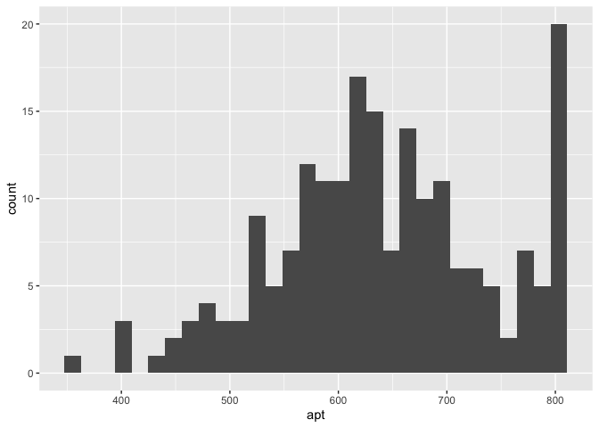

Tobit model
================
Tomoya Ozawa
2022-11-17

## 

[Reference](https://stats.oarc.ucla.edu/r/dae/tobit-models/)

``` r
library(tidyverse)
library(AER)
library(VGAM)
library(modelsummary)
```

``` r
df <- read.csv("https://stats.idre.ucla.edu/stat/data/tobit.csv")
head(df)
```

    ##   id read math       prog apt
    ## 1  1   34   40 vocational 352
    ## 2  2   39   33 vocational 449
    ## 3  3   63   48    general 648
    ## 4  4   44   41    general 501
    ## 5  5   47   43    general 762
    ## 6  6   47   46    general 658

``` r
df %>% 
  ggplot(mapping = aes(x = apt)) +
  geom_histogram(bins = 30)
```

<!-- -->

``` r
results <- list()
```

``` r
results[['OLS']] <- lm(apt ~ read + math + prog, data = df)
```

- `vglm()` from `VGAM` package

``` r
results[['vglm(VGAM)']] <- VGAM::vglm(apt ~ read + math + prog, tobit(Upper = 800), data = df)
```

- `tobit()` from `AER` package

``` r
results[['tobit(AER)']] <- AER::tobit(apt ~ read + math + prog, right = 800, data = df)
```

``` r
msummary(results, 'markdown', stars = TRUE)
```

|                 |      OLS      |  vglm(VGAM)   |  tobit(AER)   |
|:----------------|:-------------:|:-------------:|:-------------:|
| (Intercept)     | 242.735\*\*\* |               | 209.566\*\*\* |
|                 |   (30.140)    |               |   (32.772)    |
| read            |  2.553\*\*\*  |  2.698\*\*\*  |  2.698\*\*\*  |
|                 |    (0.583)    |    (0.619)    |    (0.619)    |
| math            |  5.383\*\*\*  |  5.915\*\*\*  |  5.914\*\*\*  |
|                 |    (0.659)    |    (0.705)    |    (0.710)    |
| proggeneral     |    -13.741    |    -12.715    |    -12.715    |
|                 |   (11.744)    |   (12.409)    |   (12.406)    |
| progvocational  | -48.835\*\*\* | -46.143\*\*\* | -46.144\*\*\* |
|                 |   (12.982)    |   (13.707)    |   (13.724)    |
| (Intercept) × 1 |               | 209.560\*\*\* |               |
|                 |               |   (32.546)    |               |
| (Intercept) × 2 |               |  4.185\*\*\*  |               |
|                 |               |    (0.052)    |               |
| Num.Obs.        |      200      |      200      |      200      |
| R2              |     0.613     |               |               |
| R2 Adj.         |     0.605     |               |               |
| AIC             |    2227.8     |    2094.1     |    2094.1     |
| BIC             |    2247.6     |    2113.9     |    2113.9     |
| Log.Lik.        |   -1107.894   |               |               |
| F               |    77.125     |               |               |
| RMSE            |     61.59     |     46.77     |     61.98     |

**Note:** ^^ + p \< 0.1, \* p \< 0.05, \*\* p \< 0.01, \*\*\* p \< 0.001
